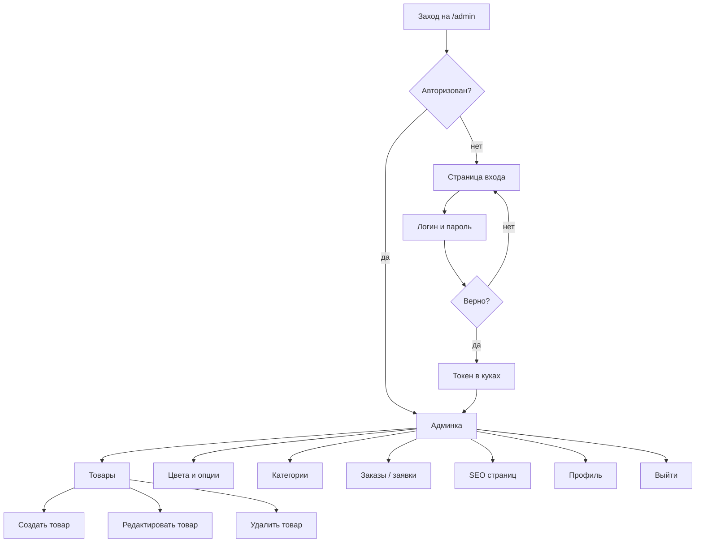

# Путь админа

Закрытая часть. Менеджер заходит, чтобы поддерживать каталог и SEO в актуальном состоянии. Неавторизованного на эти страницы не пускает middleware.

Что важно на этом пути:
- без логина в админку не попасть, протухший токен обрабатывается перехватчиками;
- товар заводится со всеми параметрами, по которым потом работает фильтр на витрине;
- SEO правится из админки, без участия разработчика;
- служебные страницы закрыты от индексации.
