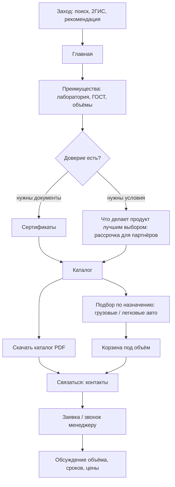

# Путь оптового клиента и дилера

Строительная компания или дилер. Им важнее не картинка, а наличие, документы, цена производителя и условия.

Что важно на этом пути:
- сертификаты и ГОСТ под рукой - без них опт не пойдёт;
- возможность скачать каталог целиком, а не кликать по одному товару;
- фильтр по назначению (нагрузка под грузовой транспорт) важнее, чем цвет;
- быстрый выход на менеджера для индивидуальных условий и рассрочки.

*схемки нарисовал ии
