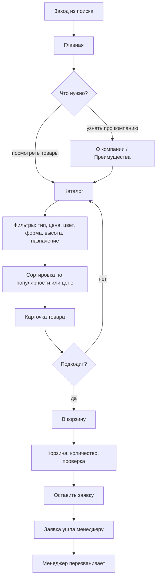

# Путь покупателя (частник)

Человек ищет плитку на двор или дорожки, заходит из поиска, чаще сразу на главную или в каталог.

Что важно на этом пути:
- быстро дойти от главной до каталога;
- фильтры должны реально сужать выбор под задачу (например, плитка под пешеходную зону, серого цвета, до 80 высоты);
- цена видна сразу, без запроса прайса;
- заявка оформляется в пару кликов.

*схемки нарисовал ии
