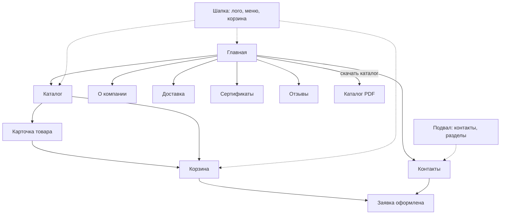

# Userflow

Здесь схемы пользовательских путей по сайту. Рисовал в mermaid, на GitHub они рендерятся прямо в превью. Разбил на три файла:

- buyer-flow.md - путь обычного покупателя (частник)
- b2b-flow.md - путь оптового клиента / дилера
- admin-flow.md - путь админа в закрытой части

Ниже общая карта переходов по сайту, чтобы было видно, как страницы связаны.

*схемки нарисовал ии
